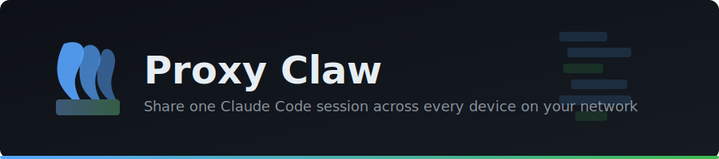

<p align="center">
  
</p>

A reverse proxy for sharing a single authenticated Claude Code session across multiple devices on a Tailscale network.

## Setup

### 1. Start MinIO

```bash
docker compose up -d minio
```

- S3 API: `localhost:9000`
- Web Console: `localhost:9001` (login: `minioadmin` / `minioadmin`)

Custom credentials:

```bash
MINIO_ROOT_USER=myadmin MINIO_ROOT_PASSWORD=mypassword docker compose up -d minio
```

Or use a `.env` file:

```env
MINIO_ROOT_USER=myadmin
MINIO_ROOT_PASSWORD=mypassword
```

### 2. Start the Proxy

#### Docker

```bash
docker build -t proxy-claw .

docker run -d \
  --name proxy-claw \
  -p 9191:9191 \
  -e MINIO_ENDPOINT=host.containers.internal:9000 \
  -e MINIO_ACCESS_KEY=minioadmin \
  -e MINIO_SECRET_KEY=minioadmin \
  -v ~/.claude:/root/.claude:ro \
  proxy-claw --port 9191 --secret YOUR_SECRET
```

> On Docker (not Podman), use `host.docker.internal` instead of `host.containers.internal`.
> On Linux without Podman/Docker Desktop, use `--network host` or the actual host IP.

#### Without Docker

```bash
pip install -r requirements.txt

export MINIO_ENDPOINT=localhost:9000
export MINIO_ACCESS_KEY=minioadmin
export MINIO_SECRET_KEY=minioadmin

python server.py --port 9191 --secret YOUR_SECRET
```

### 3. Configure Clients

On each Claude Code device:

```bash
export ANTHROPIC_BASE_URL="http://<proxy-host>:9191"
export ANTHROPIC_API_KEY="YOUR_SECRET"   # or a key created from the dashboard
claude
```

## Dashboard

Open **http://\<proxy-host\>:9191/dashboard**

The dashboard has four tabs:

- **Dashboard** — live stats, active streams, token status, recent requests, connected clients
- **Request Logs** — browse stored requests by date, click any row to view full request/response body and headers
- **API Keys** — create, disable, and delete proxy API keys. New keys are shown once on creation — copy immediately
- **Storage** — MinIO connection status and per-bucket usage


Clients authenticate with either the `--secret` value or any active API key created from the dashboard.

## Configuration

### Environment Variables

| Variable | Default | Description |
|---|---|---|
| `MINIO_ENDPOINT` | `minio:9000` | MinIO S3 API address |
| `MINIO_ACCESS_KEY` | `minioadmin` | MinIO access key |
| `MINIO_SECRET_KEY` | `minioadmin` | MinIO secret key |
| `MINIO_SECURE` | `false` | Use TLS for MinIO connection |

### CLI Arguments

```
python server.py [OPTIONS]

  --port PORT        Listen port (default: 9191)
  --secret SECRET    Shared secret for proxy auth (optional)
  --max-body BYTES   Max request body in bytes (default: 10MB)
```

### MinIO Buckets

Created automatically on startup:

| Bucket | Purpose |
|---|---|
| `proxy-logs` | Request/response pairs organized by date |
| `proxy-keys` | API key storage |
| `proxy-config` | Reserved for future use |


### Pull from GHCR and run

```bash
docker run -d \
  --name proxy-claw \
  -p 9191:9191 \
  -e MINIO_ENDPOINT=host.containers.internal:9000 \
  -e MINIO_ACCESS_KEY=minioadmin \
  -e MINIO_SECRET_KEY=minioadmin \
  -v ~/.claude:/root/.claude:ro \
  ghcr.io/10xgrace/proxy-claw:latest --port 9191
```

## License

MIT
